<div align="center">


# Gestão de Chamadas

**Chame o próximo paciente com um clique, e com um toque só seu.**

Sistema web para o setor médico chamar pacientes para atendimento: quem atende
digita o nome, escolhe o setor e o nome aparece na TV da recepção com o som da
chamada.


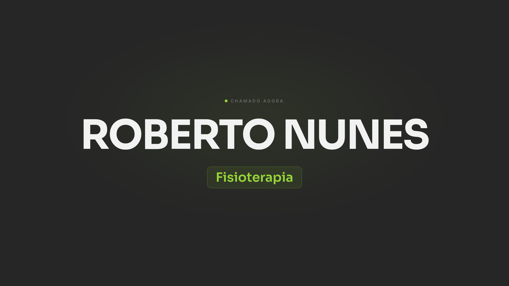

</div>

---

## Sumário

- [O que é](#o-que-é)
- [Destaques](#destaques)
- [Galeria](#galeria)
- [Como funciona](#como-funciona)
- [Regras e segurança](#regras-e-segurança)
- [Experimente em 1 minuto (local)](#experimente-em-1-minuto-local)
- [Instalação completa](#instalação-completa)
- [Estrutura do projeto](#estrutura-do-projeto)

---

## O que é

São três telas que conversam entre si:

| Tela | Endereço | Quem usa |
|---|---|---|
| **Atendimento** | `/` | Médicos e equipe: chamam o paciente e gerenciam os setores |
| **Painel da TV** | `/painel` | A TV da recepção: mostra quem foi chamado e toca o som |
| **Som da chamada** | `/som` | Quem configura: monta o jingle que a TV toca |

Tudo foi pensado para quem não tem intimidade com sistemas: botões grandes,
setores escolhidos com um toque, sem login e sem telas escondidas.

---

## Destaques

### 🎵 Gerador de jingle da chamada

O som da TV não é um arquivo de áudio pronto: **cada pessoa monta o próprio
toque** numa grade, como um mini estúdio musical, e o navegador sintetiza o som
na hora com a Web Audio API.

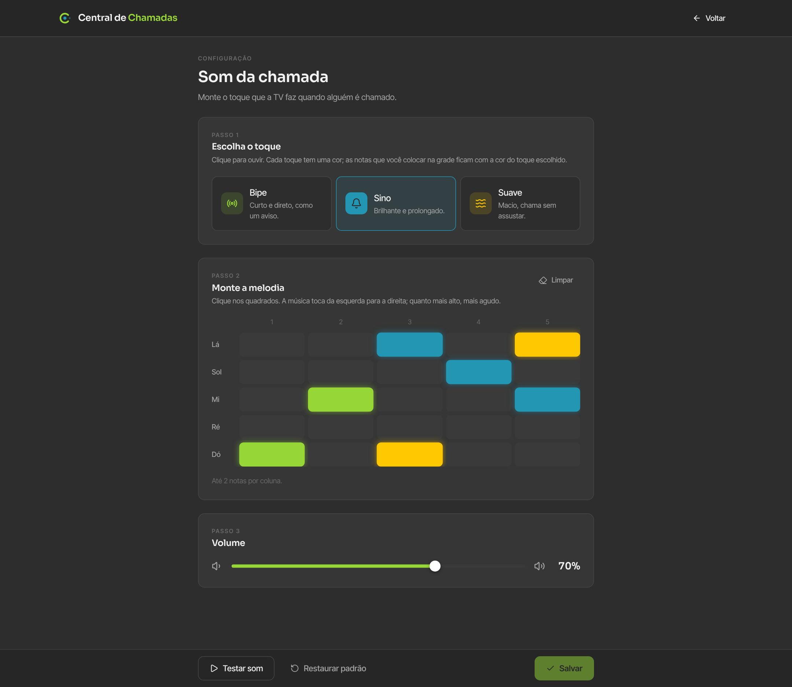

**Em três passos:**

1. **Escolha o toque.** Três timbres, cada um com sua cor. Ao clicar, você já ouve.

   | Toque | Cor | Como soa |
   |---|---|---|
   | **Bipe** | 🟩 lima `#96D737` | Curto e direto, como um aviso (onda quadrada filtrada, 120 ms) |
   | **Sino** | 🟦 ciano `#2396B4` | Brilhante e prolongado (senoide com harmônico, cai em 1,3 s) |
   | **Suave** | 🟨 âmbar `#FFC800` | Macio, chama sem assustar (onda triangular com ataque lento) |

2. **Monte a melodia.** Uma grade de **5 notas × 5 tempos**: a altura é o tom, o
   comprimento é a ordem em que toca, da esquerda para a direita.
   - Cada nota guarda **o toque que estava escolhido** quando foi colocada, então
     a mesma melodia pode misturar Bipe, Sino e Suave, e a cor mostra o que é o quê.
   - Ao clicar num quadrado, a nota toca na hora.
   - As notas são **Dó, Ré, Mi, Sol e Lá** (escala pentatônica): qualquer
     combinação soa bem, não tem como montar algo desafinado.
3. **Ajuste o volume** e clique em **Testar som**: a coluna que está tocando acende.

<table>
  <tr>
    <td width="50%">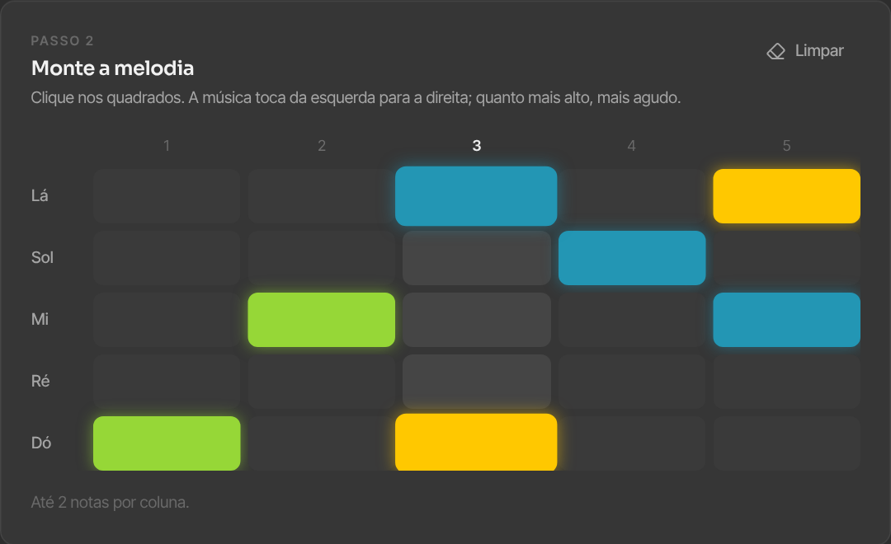<br /><sub>Testando: a coluna que está tocando acende</sub></td>
    <td width="50%">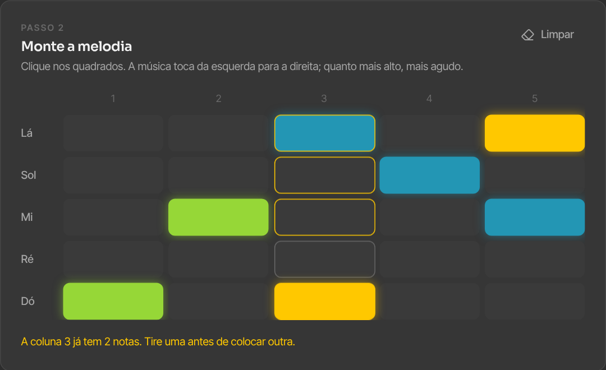<br /><sub>No máximo 2 notas por coluna: a coluna treme e explica o porquê</sub></td>
  </tr>
</table>

Ao **Salvar**, o jingle vai para o servidor e a TV passa a tocá-lo na próxima
chamada, sem precisar recarregar nada. **Restaurar padrão** volta aos três bipes
originais.

### 📣 Chamada em um clique

- Digite o nome, toque no setor (**Cardiologia**, **Enfermagem**, **Fisioterapia**
  ou os que você cadastrar) e clique em **Disparar chamada**.
- **Intervalo de 5 segundos entre chamadas:** o botão fica bloqueado e se enche
  de verde enquanto conta o tempo, para a TV não atropelar um nome com outro.
  A regra vale para todos os computadores ao mesmo tempo, porque é o servidor
  que recusa chamadas dentro do intervalo.
- **Últimas chamadas ao vivo** e **histórico** com os últimos 50 registros,
  atualizados sozinhos em todos os computadores.

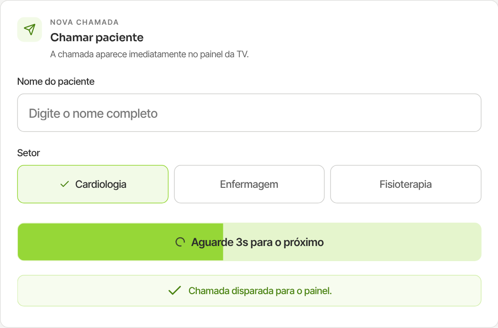

### 📺 Painel da TV

- Mostra só o essencial, em letras enormes: **o nome** e **o setor**.
- Ao chegar uma chamada nova, o nome entra com uma animação e o jingle toca.
- Tema escuro para não ofuscar a recepção.

### 🏥 Setores

Cadastre, renomeie e exclua os setores pela própria tela de atendimento. Eles
aparecem na hora como botões na chamada.

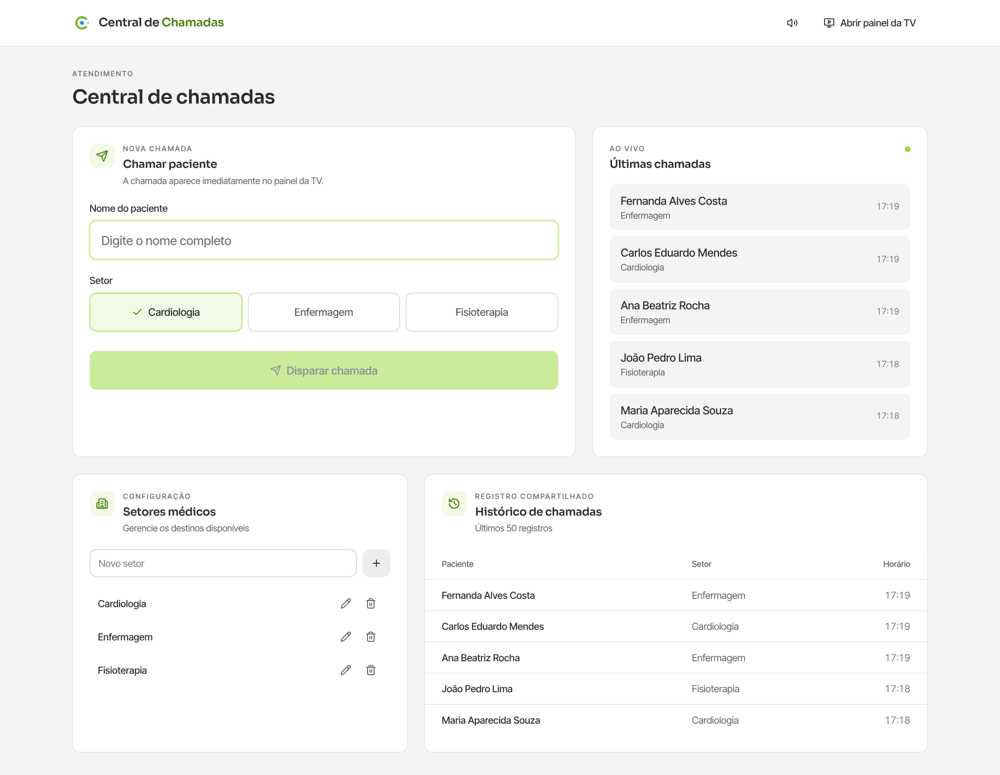

### ✨ Identidade visual

- Paleta grafite com acento **verde-lima** `#96D737` e **ciano** `#2396B4`, em
  versão clara para o atendimento e escura para a TV e o som.
- Tipografia **Sora** (títulos) e **Inter Tight** (texto).
- Logo **Monograma C**: o "C" de Chamadas envolvendo a pessoa chamada. Ao passar
  o mouse, o C gira com efeito de mola e "respira".
- Animações com curva de mola e respeito a "reduzir movimento" do sistema.

---

## Galeria

<table>
  <tr>
    <td align="center">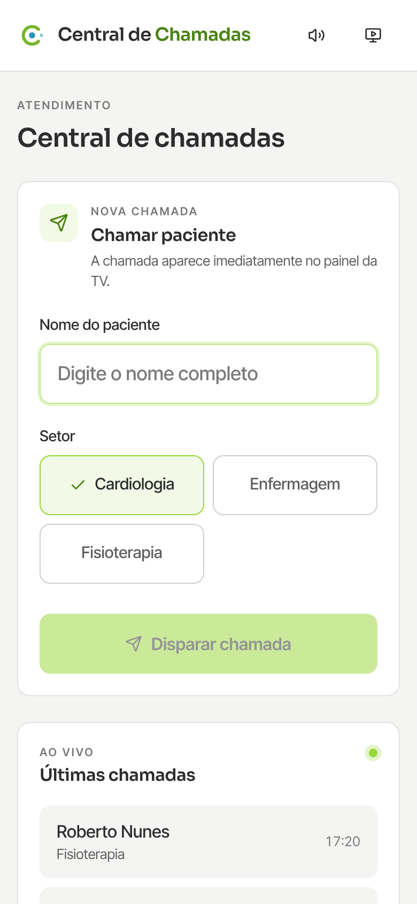<br /><sub>Atendimento</sub></td>
    <td align="center">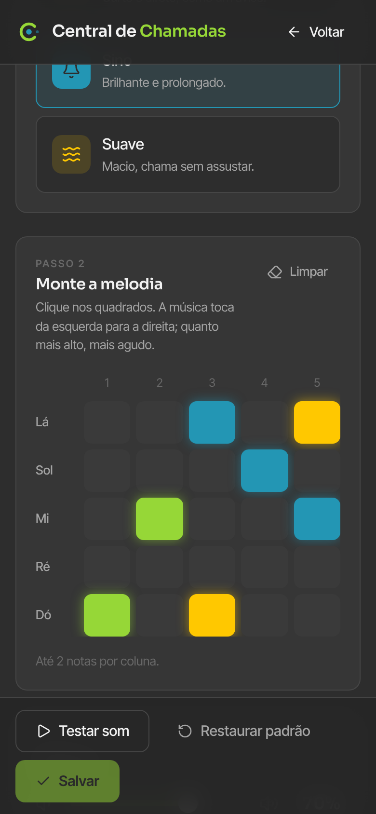<br /><sub>Som da chamada</sub></td>
    <td align="center">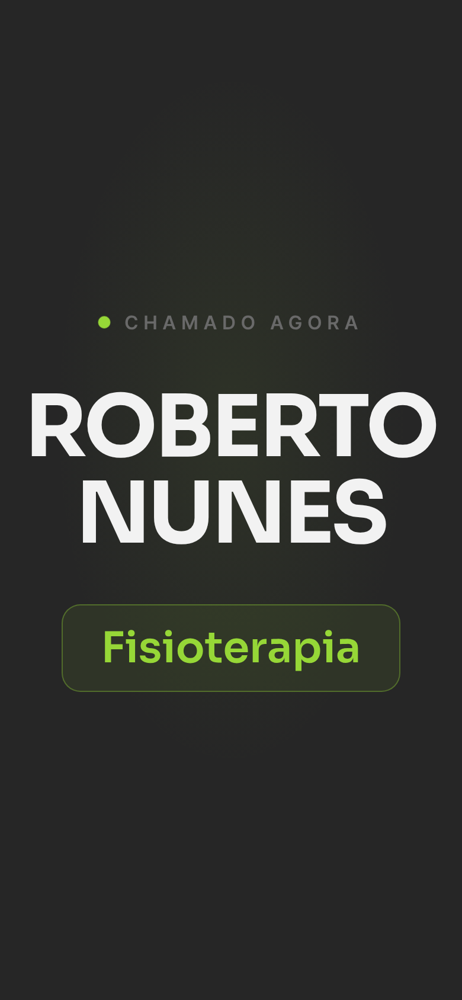<br /><sub>Painel</sub></td>
  </tr>
</table>

<sub>Todas as imagens usam nomes fictícios.</sub>

---

## Como funciona

**Stack:** Next.js 16 (App Router e Route Handlers) · TypeScript · Tailwind
CSS 4 com componentes no estilo shadcn/ui · Drizzle ORM · Postgres (Neon em
produção, PGlite embutido no modo local) · Vercel. Sem arquivos de áudio: todo
som é gerado no navegador com a Web Audio API.

### Uma chamada, do clique à TV

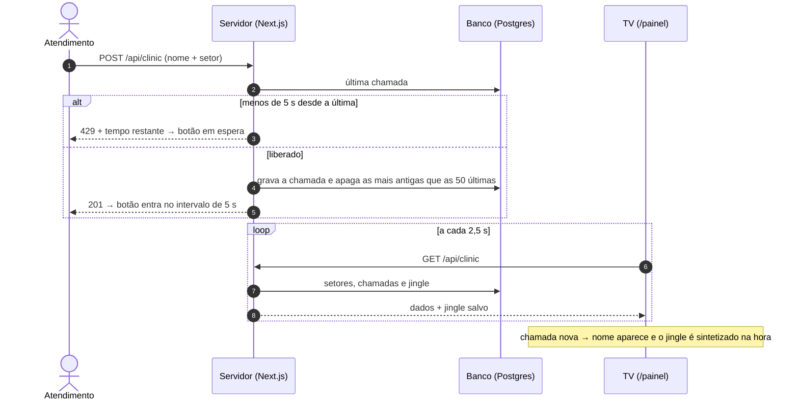

### O jingle

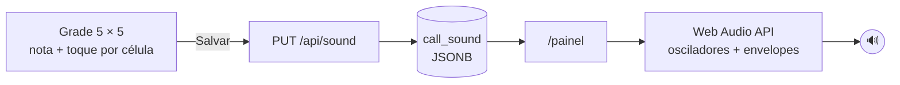

Cada coluna dura 180 ms. Cada nota vira um oscilador com o timbre do seu toque e
um envelope de volume (ataque e queda). O volume segue uma curva quadrática para
a barra soar natural.

### Dados

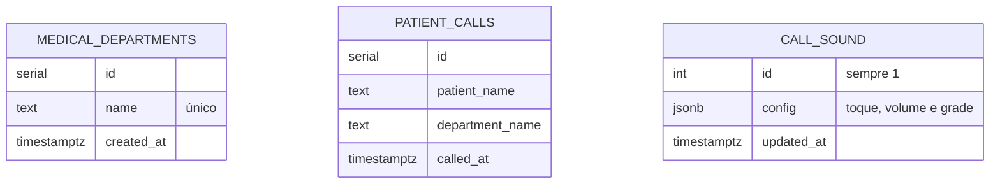

As tabelas são criadas sozinhas na primeira requisição (`lib/init-sql.ts`). Os
setores iniciais só entram quando a tabela está vazia, então excluir um setor
não faz ele voltar.

---

## Regras e segurança

| Regra | Onde é garantida |
|---|---|
| Intervalo mínimo de 5 s entre chamadas | Servidor (`POST /api/clinic` responde 429) e botão |
| Histórico limitado às últimas 50 chamadas | Servidor, a cada chamada nova |
| Jingle válido (5 notas, 5 tempos, até 2 notas por coluna, volume 0 a 100) | Servidor normaliza tudo antes de salvar |
| `DATABASE_URL` | Só em variáveis de ambiente (`.env.local` e Vercel) |

> [!NOTE]
> Decisão consciente para uso interno: **não há login**. Qualquer pessoa com o
> link consegue chamar pacientes, editar setores e trocar o jingle. Divulgue o
> endereço só para a equipe ou ative a proteção por senha da Vercel.

---

## Experimente em 1 minuto (local)

Roda sem banco externo: sem `DATABASE_URL`, o sistema usa um Postgres embutido
(PGlite) gravado na pasta `.data/`.

```bash
npm run iniciar
```

O comando instala as dependências na primeira vez, sobe o servidor e abre o
navegador em `http://localhost:3000`.

| Tela | Endereço |
|---|---|
| Atendimento | `http://localhost:3000` |
| Painel da TV | `http://localhost:3000/painel` |
| Som da chamada | `http://localhost:3000/som` |

Para zerar os dados, apague a pasta `.data/`.

---

## Instalação completa

### 1. Banco (Neon)

1. Crie um banco Postgres no [Neon](https://neon.tech) (ou em **Vercel → Storage →
   Neon**).
2. Copie a connection string. Não precisa rodar nenhum SQL: as tabelas são
   criadas sozinhas.

### 2. Vercel

1. **Add New → Project** e importe este repositório (a Vercel detecta o Next.js).
2. Em **Environment Variables** (ou conectando o banco em **Storage**):

| Nome | Valor |
|---|---|
| `DATABASE_URL` | connection string do Neon |

3. **Deploy.** Abra o endereço no computador de atendimento e `/painel` na TV.

> [!TIP]
> Na TV, clique uma vez na tela depois de abrir o `/painel`: os navegadores só
> liberam o som depois de uma interação com a página.

### 3. Rodar localmente com o Neon

Crie `.env.local` com `DATABASE_URL=<connection string>` e rode `npm run iniciar`.

---

## Estrutura do projeto

```
app/
├── page.tsx                    # atendimento: chamada, setores, histórico
├── painel/page.tsx             # painel da TV
├── som/page.tsx                # gerador do jingle
├── api/clinic/route.ts         # chamadas e setores (+ intervalo de 5 s)
├── api/sound/route.ts          # leitura e gravação do jingle
├── layout.tsx                  # fontes, metadados
└── globals.css                 # tokens de cor, animações
components/
├── brand/                      # Logo e Mark (Monograma C animado)
└── ui/                         # Button, Card, Input, Label, LiveDot
lib/
├── sound.ts                    # notas, toques, síntese Web Audio, validação
├── db.ts                       # Postgres (Neon) ou PGlite embutido
├── schema.ts                   # tabelas (Drizzle)
└── init-sql.ts                 # criação das tabelas e setores iniciais
iniciar.mjs                     # npm run iniciar
docs/images/                    # imagens deste README
```
